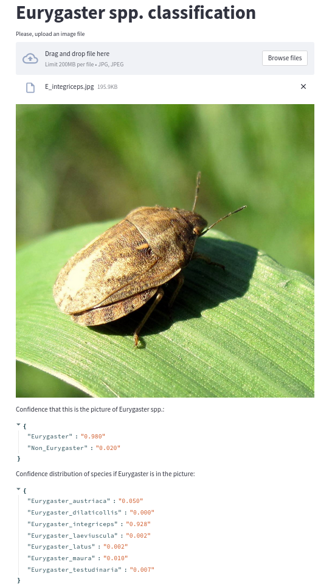

#### Eurygaster spp. classification application

* The project is based on [streamlit](https://share.streamlit.io/daniellewisdl/streamlit-cheat-sheet/app.py) deployment
  python library.
* Application is available for [Heroku](https://www.heroku.com/) and Docker deployment.
* Link to the Heroku demo: [eurygaster-app](https://eurygaster-app.herokuapp.com/).

